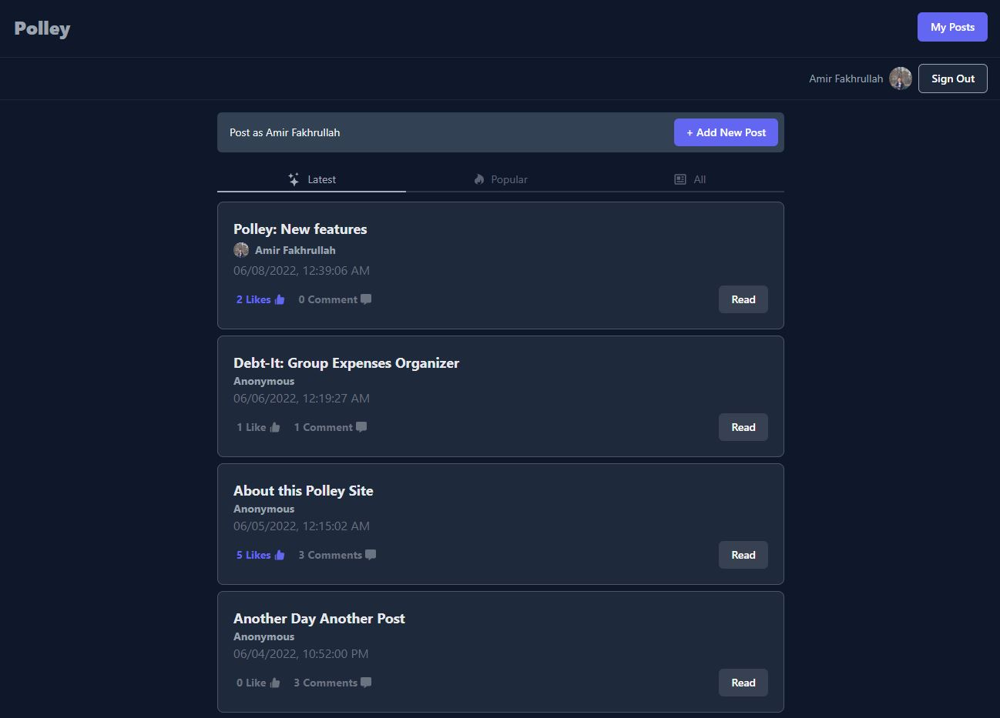

# Polley :newspaper:

Simple Forum site using `Next.js`, `TypeScript`, `Prisma`, `PlanetScale` and `tRPC`. The aim here is to learn how to properly use these techstacks.



## Goals For This Project

I know the UI for this project is pretty trash. But that's not the goal for building this site. The goals for this project are:

- Creating fully typesafe APIs using `tRPC`
- Using `Prisma` as `TypeScript ORM`
- Setting up `PlanetScale` as `MySQL` db for the site
- Set cookie for anonymous users thru `Next.js` middleware
- Auth using `Next-Auth` (Github Provider)

## Techstacks

- [Next.js](https://nextjs.org/)
- [TailwindCSS](https://tailwindcss.com/)
- [Next Auth](https://next-auth.js.org/)
- [TypeScript](https://www.typescriptlang.org/)
- [tRPC](https://trpc.io/)
- [Prisma](https://www.prisma.io/)
- [PlanetScale](https://planetscale.com/)
- [Vercel](https://vercel.com/)

## Getting Started

### Prerequisite

- `MySQL` local database or Planetscale connection using `PScale CLI`
- `npm`

### Installations

After cloning the repo, set up `.env` file with db url

```bash
DATABASE_URL="mysql://localhost:InsertPortHere/InsertDbNameHere"
```

For setting up `Next Auth` Github provider, insert Github Id and secrets in `.env.local`

```bash
GITHUB_ID=
GITHUB_SECRET=
NEXTAUTH_SECRET=
```

Then, proceed with installing:

```bash
npm install
```

### Run locally

Run the development server:

```bash
pscale connect `InsertDbNameHere` #for connecting planetscale db
npm run dev
```

## Possible Future Works

- [ ] Refactoring repetitive codes (buttons, etc)
- [ ] Ability to delete own posts or comments
- [ ] Liking and disliking system
- [ ] Markdown editor for posts :astonished:
- [x] Next Auth :astonished:
