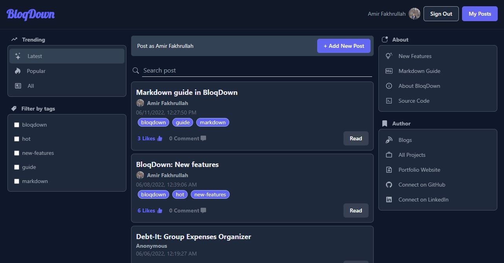

<div align="center">
  
</div>

<p align="center">
  <a href="https://github.com/amirfakhrullah/BloqDown/projects/1">Roadmap</a> •
  <a href="https://github.com/amirfakhrullah/BloqDown/issues">Issues</a> •
  <a href="https://github.com/amirfakhrullah/BloqDown/pulls">Pull Requests</a> •
  <a href="https://github.com/amirfakhrullah/BloqDown/discussions">Discussions</a> •
  <a href="https://github.com/amirfakhrullah/BloqDown/releases">Releases</a>
</p>

## Quick Description

Simple Markdown Forum/blog site using `Next.js`, `Next-Auth`, `TypeScript`, `Prisma`, `PlanetScale` and `tRPC`. The aim here is to learn how to properly use these techstacks.



### Links

* **Website** - [bloqdown.fakhrullah.com](https://bloqdown.fakhrullah.com)
* **Codebase** - [github.com/amirfakhrullah/BloqDown](https://github.com/amirfakhrullah/BloqDown)

### Open Source Guides

<p align="center">
  <a href="https://github.com/amirfakhrullah/BloqDown/blob/main/LICENSE">License</a> •
  <a href="https://github.com/amirfakhrullah/BloqDown/blob/main/CONTRIBUTING.md">Contributing</a> •
  <a href="https://github.com/amirfakhrullah/BloqDown/blob/main/CODE_OF_CONDUCT.md">Code of Conduct</a>
</p>

## Goals For This Project

I know the UI for this project is not great. But that's not the goal for building this site. The goals for this project are:

- Creating fully typesafe APIs using `tRPC`
- Using `Prisma` as `TypeScript ORM`
- Setting up `PlanetScale` as `MySQL` db for the site
- Set cookie for anonymous users thru `Next.js` middleware
- Auth using `Next-Auth` (Github Provider)
- Render post content as markdown using `react-markdown`

## Techstacks

- [Next.js](https://nextjs.org/)
- [TailwindCSS](https://tailwindcss.com/)
- [DaisyUI](https://daisyui.com/)
- [React-Markdown](https://github.com/remarkjs/react-markdown)
- [Next-Auth](https://next-auth.js.org/)
- [TypeScript](https://www.typescriptlang.org/)
- [tRPC](https://trpc.io/)
- [Prisma](https://www.prisma.io/)
- [PlanetScale](https://planetscale.com/)
- [Vercel](https://vercel.com/)

## Getting Started

### Prerequisite

- `MySQL` local database or Planetscale connection using `PScale CLI`
- `npm`

### Installations

After cloning the repo, set up `.env` file with db url

```bash
DATABASE_URL="mysql://localhost:InsertPortHere/InsertDbNameHere"
```

For setting up `Next Auth` Github provider, insert Github Id and secrets in `.env.local`

```bash
GITHUB_ID=
GITHUB_SECRET=
NEXTAUTH_SECRET=
```

Then, proceed with installing:

```bash
npm install
```

### Run locally

Run the development server:

```bash
pscale connect `InsertDbNameHere` #for connecting planetscale db
npm run dev
```

## Possible Future Works

- [ ] Refactoring repetitive codes (buttons, etc)
- [x] Update posts by post owner
- [x] Ability to delete own posts or comments
- [x] Liking posts
- [x] Sorting posts by latest & popularity
- [x] Markdown editor for posts :astonished:
- [x] Next Auth :astonished:
- [x] Tags
- [x] Tags filtering section in LeftNav component
- [x] Searchbar for searching posts
