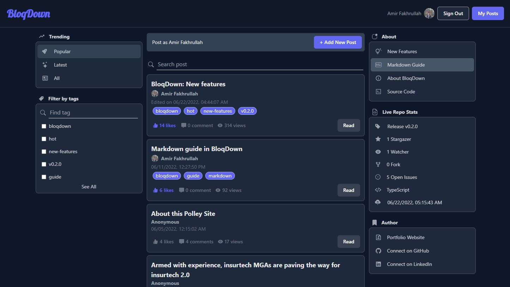

<div align="center">
  
</div>

<p align="center">
  <a href="https://github.com/amirfakhrullah/BloqDown/releases">Releases</a> •
  <a href="https://github.com/amirfakhrullah/BloqDown/blob/main/LICENSE">License</a> •
  <a href="https://github.com/amirfakhrullah/BloqDown/blob/main/CONTRIBUTING.md">Contributing</a> •
  <a href="https://github.com/amirfakhrullah/BloqDown/blob/main/CODE_OF_CONDUCT.md">Code of Conduct</a>
</p>

## Description

Simple Markdown Forum/Blog site using `Next.js`, `NextAuth`, `TypeScript`, `tRPC`, `Prisma` and `PlanetScale`. The aim here is to learn how to properly use these techstacks.



## Quick Links

<p align="center">
  <a href="https://bloqdown.fakhrullah.com">Website</a> •
  <a href="https://github.com/amirfakhrullah/BloqDown/projects/1">Roadmap</a> •
  <a href="https://github.com/amirfakhrullah/BloqDown/issues">Issues</a> •
  <a href="https://github.com/amirfakhrullah/BloqDown/pulls">Pull Requests</a> •
  <a href="https://github.com/amirfakhrullah/BloqDown/discussions">Discussions</a>
</p>

## Goals For This Project

The goals for this project are:

- Creating fully typesafe APIs using `tRPC`
- Using `Prisma` as `TypeScript ORM`
- Setting up `PlanetScale` as `MySQL` db for the site
- Set cookie for anonymous users thru `Next.js` middleware
- Auth using `NextAuth` (Github Provider)
- Render markdown content using `react-markdown` and `@tailwindcss/typography`
- Display repository data using `GitHub API`

## Project Features

- **Users** - Can perform any activity anonymously or can login as GitHub user (via `NextAuth`)
- **Homepage** - Users can find posts sorted by popularity or latest. They can also find posts via tags and search bar
- **Base features of posts** - Creating, updating and deleting posts
- **Liking** - Users can like any posts they want
- **Comments** - Users can comments to any posts, the users and the post owners can delete comments
- **Tags** - Users can add category tags to the posts, so that users can find the posts via tags in the homepage
- **Views** - Total views of the post (not unique)
- **Live Repository Stats** - Live repository data of this project fetched using `GitHub API`


## Techstacks

- [Next.js](https://nextjs.org/)
- [TailwindCSS](https://tailwindcss.com/)
- [DaisyUI](https://daisyui.com/)
- [TailwindCSS-Typography](https://tailwindcss.com/docs/typography-plugin)
- [React-Markdown](https://github.com/remarkjs/react-markdown)
- [Next-Auth](https://next-auth.js.org/)
- [TypeScript](https://www.typescriptlang.org/)
- [tRPC](https://trpc.io/)
- [Prisma](https://www.prisma.io/)
- [PlanetScale](https://planetscale.com/)
- [Vercel](https://vercel.com/)

## Getting Started

### Prerequisite

- `MySQL` local database or Planetscale connection using `PScale CLI`
- `npm`

### Installations

After cloning the repo, set up `.env` file with db url

```bash
DATABASE_URL="mysql://localhost:InsertPortHere/InsertDbNameHere"
```

For setting up `Next Auth` Github provider, insert Github Id and secrets in `.env.local`

```bash
GITHUB_ID=
GITHUB_SECRET=
GITHUB_ACCESS_TOKEN=
NEXTAUTH_SECRET=
```

Then, proceed with installing:

```bash
npm install
```

### Run locally

Run the development server:

```bash
pscale connect `InsertDbNameHere` #for connecting planetscale db
npm run dev
```
